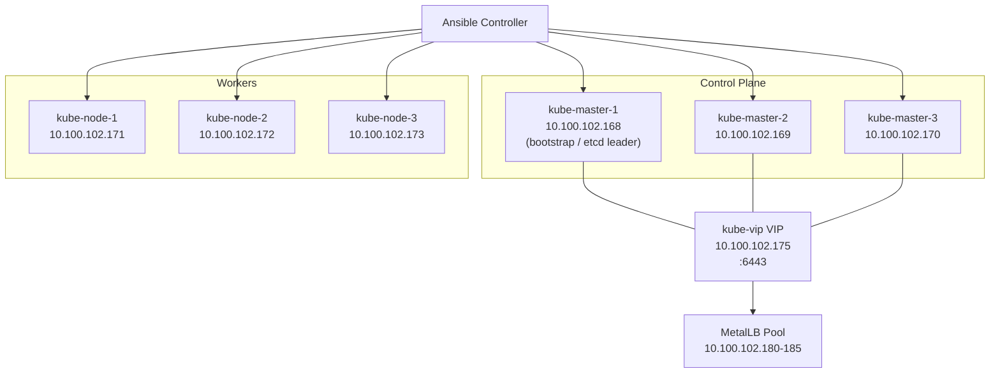
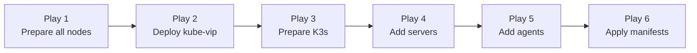

# K3s Homelab Cluster

Ansible playbook that deploys a high-availability [K3s](https://k3s.io/) Kubernetes cluster on 6 bare-metal/VM nodes with:

- Embedded **etcd** HA control-plane (no external datastore required)
- Virtual control-plane IP via [kube-vip](https://kube-vip.io/) (ARP mode)
- LoadBalancer IP pool via [MetalLB](https://metallb.universe.tf/)
- Longhorn-ready disk provisioning (`/dev/sdb` formatted and mounted on every node)
- Traefik ingress (K3s default — ServiceLB disabled, MetalLB used instead)

**Cluster topology:**
- 3 control-plane servers (`10.100.102.168–170`) — 4 GB RAM, 4 vCPU, 50 GB OS disk + 60 GB Longhorn disk
- 3 worker agents (`10.100.102.171–173`) — 4 GB RAM, 4 vCPU, 50 GB OS disk + 60 GB Longhorn disk
- Control-plane VIP: `10.100.102.175`
- MetalLB LoadBalancer pool: `10.100.102.180–185`

---

## Architecture



---

## Prerequisites

| Requirement | Detail |
|---|---|
| OS / arch | Ubuntu 26.04 LTS (resolute), amd64 |
| RAM | **Minimum 2 GB per node** — control-plane nodes need ≥2 GB for etcd + kube-apiserver |
| Ansible | >= 2.14 on the controller |
| SSH key | `~/.ssh/ansible-new` with access to all nodes as `simonj` |
| Passwordless sudo | Already applied on all 6 nodes: `simonj ALL=(ALL) NOPASSWD: ALL` |
| Python | `/usr/bin/python3.14` on all target nodes |
| Disks | `sda` — OS (50 GB); `sdb` — Longhorn data (60 GB, raw, no existing filesystem) |
| Ports | TCP 6443 (API / join), plus standard Kubernetes inter-node ports |

Install required Ansible collections before running:

```bash
ansible-galaxy collection install -r collections/requirements.yaml
```

Collections used:

| Collection | Purpose |
|---|---|
| `ansible.posix` | `sysctl` and `mount` modules |
| `ansible.utils` | Utility filters |
| `community.general` | `filesystem` module for sdb formatting |
| `kubernetes.core` | Kubernetes API interaction (listed as dependency) |

---

## Quick Start

```bash
ansible-playbook site.yaml
```

That's it. Run from the repo root. Full steps below.

1. **Clone the repository**

   ```bash
   git clone <repo-url>
   cd Ansible
   git checkout K3s-Cluster
   ```

2. **Verify the inventory** matches your nodes (`inventory/hosts.ini`)

3. **Verify the variables** in `inventory/group_vars/all.yaml`

4. **Install Ansible collections** (first time only)

   ```bash
   ansible-galaxy collection install -r collections/requirements.yaml
   ```

5. **Run the playbook**

   ```bash
   ansible-playbook site.yaml
   ```

   The full run takes 5–15 minutes depending on hardware and internet speed. All 6 nodes are configured in parallel where possible.

---

## Inventory

`inventory/hosts.ini`:

```ini
[servers]
kube-master-1 ansible_host=10.100.102.168
kube-master-2 ansible_host=10.100.102.169
kube-master-3 ansible_host=10.100.102.170

[agents]
kube-node-1 ansible_host=10.100.102.171
kube-node-2 ansible_host=10.100.102.172
kube-node-3 ansible_host=10.100.102.173

[k3s:children]
servers
agents

[k3s:vars]
ansible_user=simonj
```

- `servers` — K3s control-plane nodes. **`kube-master-1` is always the bootstrap node** (it initialises the embedded etcd cluster with `cluster-init: true`).
- `agents` — K3s worker nodes.
- `k3s` — parent group encompassing all nodes.

---

## Configuration

All user-facing variables live in `inventory/group_vars/all.yaml`.

| Variable | Value | Description |
|---|---|---|
| `os` | `linux` | Target OS |
| `arch` | `amd64` | Target architecture |
| `vip` | `10.100.102.175` | Virtual IP for the control-plane, managed by kube-vip |
| `k3s_version` | `v1.36.2+k3s1` | K3s release to download |
| `k3s_install_dir` | `/usr/local/bin` | Directory the K3s binary is installed to |
| `kube_vip_version` | `v1.2.0` | kube-vip image tag |
| `vip_interface` | `ens18` | Network interface kube-vip binds the VIP to |
| `metallb_version` | `v0.16.0` | MetalLB release to deploy |
| `lb_range` | `10.100.102.180-10.100.102.185` | MetalLB `IPAddressPool` range |
| `lb_pool_name` | `first-pool` | Name of the MetalLB `IPAddressPool` resource |

---

## Playbook Flow

The main playbook `site.yaml` runs six sequential plays:



| # | Play | Target hosts | What happens |
|---|---|---|---|
| 1 | Prepare all nodes | `k3s` (all) | Enable IPv4/IPv6 forwarding; install Longhorn prereqs (`open-iscsi`, `nfs-common`); format `/dev/sdb` as ext4 and mount to `/var/lib/longhorn`; download the K3s binary to `/usr/local/bin` |
| 2 | Deploy kube-vip | `servers` | Create `/var/lib/rancher/k3s/server/manifests/`; render the kube-vip DaemonSet manifest onto `kube-master-1` for auto-deployment at bootstrap |
| 3 | Prepare K3s on servers and agents | `servers`, `agents` | Deploy bootstrap server config (`cluster-init: true`) to all servers; deploy systemd units to servers and agents; start `k3s-server` on `kube-master-1`; wait for the node token; distribute join token as a host fact; create `kubectl` symlink; copy kubeconfig for `simonj` |
| 4 | Add additional K3s servers | `servers` | Deploy join config (with token) to `kube-master-2`/`kube-master-3`; wait for cluster API on `kube-master-1`; apply kube-vip RBAC and cloud-controller manifests; start `k3s-server` on remaining servers |
| 5 | Add agents | `agents` | Deploy agent join config (with token); start/restart `k3s-agent` on all agents |
| 6 | Apply manifests | `servers` | Wait for all `server=true` nodes Ready; deploy MetalLB native manifest (v0.16.0); wait for MetalLB controller pod; apply `L2Advertisement`; render and apply `IPAddressPool` |

---

## Role Reference

| Role | Directory | Summary |
|---|---|---|
| `prepare-nodes` | `roles/prepare-nodes/` | Sets IP forwarding via sysctl; installs Longhorn prerequisites; formats `/dev/sdb` as ext4 and mounts it to `/var/lib/longhorn` on all nodes |
| `k3s-download` | `roles/k3s-download/` | Creates `k3s_install_dir` and downloads the K3s binary from GitHub releases |
| `kube-vip` | `roles/kube-vip/` | Renders and places the kube-vip DaemonSet manifest (ARP mode on `ens18`) on `kube-master-1` for K3s to auto-apply at bootstrap |
| `k3s-prepare` | `roles/k3s-prepare/` | Bootstraps `kube-master-1` with embedded etcd (`cluster-init: true`), creates systemd service units for servers and agents, captures and distributes the cluster join token, creates the `kubectl` symlink, and sets up kubeconfig |
| `add-server` | `roles/add-server/` | Joins `kube-master-2` and `kube-master-3` to the cluster using the bootstrap token; applies kube-vip RBAC and cloud-controller |
| `add-agent` | `roles/add-agent/` | Joins all agent nodes using the bootstrap token |
| `apply-manifests` | `roles/apply-manifests/` | Deploys MetalLB (controller, L2Advertisement, IPAddressPool) |

---

## Post-Installation

After a successful run, the kubeconfig is available on `kube-master-1` at:

```
/home/simonj/.kube/config
```

The API server is accessible via the kube-vip VIP:

```bash
kubectl --kubeconfig ~/.kube/config get nodes
```

The cluster is configured with:
- **Ingress**: Traefik (K3s default)
- **CNI**: Flannel (K3s default)
- **ServiceLB**: Disabled — MetalLB handles all `LoadBalancer` IPs
- **Node labels**: `server=true` on control-plane nodes, `agent=true` on worker nodes
- **Longhorn storage**: `/dev/sdb` mounted to `/var/lib/longhorn` on every node, ready for Longhorn installation

### Next steps (manual, via Helm)

```bash
# cert-manager (required by Longhorn and Traefik TLS)
helm repo add jetstack https://charts.jetstack.io
helm install cert-manager jetstack/cert-manager --namespace cert-manager --create-namespace --set crds.enabled=true

# Longhorn
helm repo add longhorn https://charts.longhorn.io
helm install longhorn longhorn/longhorn --namespace longhorn-system --create-namespace

# Headlamp (optional Kubernetes UI)
helm repo add headlamp https://headlamp-k8s.github.io/headlamp/
helm install headlamp headlamp/headlamp --namespace headlamp --create-namespace --set service.type=LoadBalancer
```

---

## Migrating from RKE2

This playbook targets the **same 6 nodes** as the `RKE2-Cluster` branch. Running both on the same nodes simultaneously will cause conflicts (duplicate VIP, port 6443, shared `/dev/sdb` mount).

Note: the RKE2 branch installs RKE2 as a **raw binary + hand-written systemd units** (no official `install.sh`/`rke2-uninstall.sh` script is ever run), so there is no bundled uninstaller to call — clean up manually instead. Before running this playbook:

1. Stop and disable the RKE2 services on all nodes:

   ```bash
   # On each server node
   sudo systemctl stop rke2-server
   sudo systemctl disable rke2-server

   # On each agent node
   sudo systemctl stop rke2-agent
   sudo systemctl disable rke2-agent
   ```

2. Remove the RKE2 systemd units, binary, and data directories (on all nodes):

   ```bash
   sudo rm -f /etc/systemd/system/rke2-server.service /etc/systemd/system/rke2-agent.service
   sudo systemctl daemon-reload
   sudo rm -rf /etc/rancher/rke2 /var/lib/rancher/rke2 /usr/local/bin/rke2 /usr/local/bin/kubectl
   ```

3. Reboot all nodes (recommended — ensures the VIP is released, `/dev/sdb`'s mount is cleanly re-established, and kernel/network state is fresh):

   ```bash
   sudo reboot
   ```

4. Run this playbook:

   ```bash
   ansible-playbook site.yaml
   ```

---

## Known Limitations / TODOs

- **Tested on amd64 only** — The download URL derives the binary name from the `arch` variable (`k3s` for `amd64`, `k3s-arm64`/`k3s-armhf` otherwise), so changing `arch` in `group_vars/all.yaml` should work, but only the `amd64` path has actually been run/tested in this homelab.
- **Ubuntu 26.04 not in K3s support matrix** — Only Ubuntu 22.04 and 24.04 are officially tested. Works fine in practice on 26.04.
- **Minimum 2 GB RAM per control-plane node** — K3s is lighter than RKE2 but still needs ≥2 GB for the embedded etcd + kube-apiserver on the control-plane nodes.
- **No multi-CNI support** — Only the K3s default CNI (Flannel) is supported. Calico or Cilium would require additional configuration and disabling Flannel at install time.
- **`kubernetes.core` collection unused** — Listed as a collection dependency but all cluster interactions use raw `kubectl` commands. A future improvement would be to replace `kubectl` shell commands with `kubernetes.core` tasks.
- **Wait logic is basic** — Server readiness polling uses fixed retry/delay loops. Slow environments may need `retries` values increased in `roles/add-server/tasks/main.yaml` and `roles/apply-manifests/tasks/main.yaml`.
- **No reset/uninstall playbook** — K3s ships its own uninstall scripts (`k3s-uninstall.sh` on servers, `k3s-agent-uninstall.sh` on agents). A `reset.yaml` play could wrap these for convenience.
