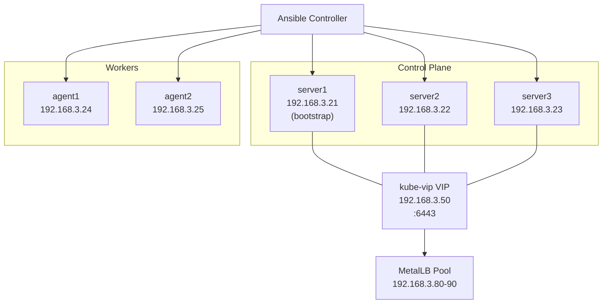
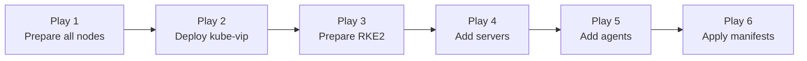

# RKE2 Homelab Cluster

Ansible playbook that deploys a high-availability [RKE2](https://docs.rke2.io/) Kubernetes cluster with a virtual IP via [kube-vip](https://kube-vip.io/) and a LoadBalancer IP pool via [MetalLB](https://metallb.universe.tf/). Intended for homelab use on bare-metal or VM nodes.

**Cluster topology (defaults):**
- 3 control-plane servers (`192.168.3.21–23`)
- 2 worker agents (`192.168.3.24–25`)
- Control-plane VIP: `192.168.3.50`
- MetalLB LoadBalancer pool: `192.168.3.80–90`

---

## Architecture



---

## Prerequisites

| Requirement | Detail |
|---|---|
| OS / arch | Linux amd64 only |
| Ansible | >= 2.14 on the controller |
| Target nodes | Reachable via SSH as `ansible` user with passwordless `sudo` |
| Python | Must be present on all target nodes |
| Ports | TCP 6443 (API), TCP 9345 (RKE2 supervisor), and standard Kubernetes ports open between nodes |

Install required Ansible collections before running:

```bash
ansible-galaxy collection install -r collections/requirements.yaml
```

Collections used:

| Collection | Purpose |
|---|---|
| `ansible.posix` | `sysctl` module for IP forwarding |
| `ansible.utils` | Utility filters |
| `community.general` | General-purpose modules |
| `kubernetes.core` | Kubernetes API interaction (listed as dependency) |

---

## Quick Start

1. **Clone the repository**

   ```bash
   git clone <repo-url>
   cd Ansible
   ```

2. **Edit the inventory** to match your node IPs

   ```bash
   # inventory/hosts.ini
   ```

3. **Edit the variables** to match your network

   ```bash
   # inventory/group_vars/all.yaml
   ```

4. **Install collections**

   ```bash
   ansible-galaxy collection install -r collections/requirements.yaml
   ```

5. **Run the playbook**

   ```bash
   ansible-playbook site.yaml
   ```

   The full run takes 5–15 minutes depending on hardware and internet speed (RKE2 binary download + MetalLB pod startup).

---

## Inventory

Edit `inventory/hosts.ini` to define your nodes:

```ini
[servers]
server1 ansible_host=192.168.3.21
server2 ansible_host=192.168.3.22
server3 ansible_host=192.168.3.23

[agents]
agent1 ansible_host=192.168.3.24
agent2 ansible_host=192.168.3.25

[rke2:children]
servers
agents

[rke2:vars]
ansible_user=ansible
```

- `servers` — RKE2 control-plane nodes. **The first host (`server1`) is always the bootstrap node.**
- `agents` — RKE2 worker nodes.
- `rke2` — parent group encompassing all nodes; used for plays that target the full cluster.

> The playbook references `server1`, `server2`, and `server3` by name in several templates. If you rename these hosts, update the template references in `roles/rke2-prepare/templates/rke2-server-config.j2` and `roles/add-server/templates/rke2-server-config.j2` accordingly.

---

## Configuration

All user-facing variables live in `inventory/group_vars/all.yaml`.

| Variable | Default | Description |
|---|---|---|
| `os` | `linux` | Target OS (used in the RKE2 download URL) |
| `arch` | `amd64` | Target architecture (used in the RKE2 download URL) |
| `vip` | `192.168.3.50` | Virtual IP for the control-plane, managed by kube-vip |
| `metallb_version` | `v0.13.12` | MetalLB release to deploy |
| `lb_range` | `192.168.3.80-192.168.3.90` | MetalLB `IPAddressPool` range |
| `lb_pool_name` | `first-pool` | Name of the MetalLB `IPAddressPool` resource |
| `rke2_version` | `v1.29.4+rke2r1` | RKE2 release to download (override in `roles/rke2-download/defaults/main.yml`) |
| `kube_vip_version` | `v0.8.0` | kube-vip image tag (override in `roles/kube-vip/defaults/main.yaml`) |
| `vip_interface` | `eth0` | Network interface kube-vip binds the VIP to (override in `roles/kube-vip/defaults/main.yaml`) |
| `rke2_install_dir` | `/usr/local/bin` | Directory the RKE2 binary is downloaded to (override in `roles/rke2-download/defaults/main.yml`) |

To override a role default without editing the role, add the variable to `inventory/group_vars/all.yaml`. For example:

```yaml
rke2_version: "v1.30.2+rke2r1"
vip_interface: "ens18"
```

---

## Playbook Flow

The main playbook `site.yaml` runs six sequential plays:



| # | Play | Target hosts | What happens |
|---|---|---|---|
| 1 | Prepare all nodes | `rke2` (all) | Enable IPv4/IPv6 forwarding via sysctl; download the RKE2 binary to `/usr/local/bin` |
| 2 | Deploy kube-vip | `servers` | Create `/var/lib/rancher/rke2/server/manifests/`; render the kube-vip DaemonSet manifest onto `server1` for auto-deployment at bootstrap |
| 3 | Prepare RKE2 | `servers`, `agents` | Deploy server config + systemd unit to all servers; deploy agent systemd unit to agents; start `rke2-server` on `server1`; wait for the node token; slurp the join token and distribute it as a host fact; copy kubeconfig for the `ansible` user |
| 4 | Add additional servers | `servers` | Deploy join config (with token) to `server2`/`server3`; wait for cluster API on `server1`; apply kube-vip RBAC and cloud-controller manifests; start `rke2-server` on remaining servers |
| 5 | Add agents | `agents` | Deploy agent join config (with token); start/restart `rke2-agent` on all agents |
| 6 | Apply manifests | `servers` | Wait for all `server=true` nodes Ready; deploy MetalLB namespace + native manifest; wait for MetalLB controller pod; apply L2Advertisement; render and apply `IPAddressPool` |

---

## Role Reference

| Role | Directory | Summary |
|---|---|---|
| `prepare-nodes` | `roles/prepare-nodes/` | Sets `net.ipv4.ip_forward` and `net.ipv6.conf.all.forwarding` to `1` via sysctl on all nodes |
| `rke2-download` | `roles/rke2-download/` | Creates `rke2_install_dir` and downloads the RKE2 binary from GitHub releases |
| `kube-vip` | `roles/kube-vip/` | Renders and places the kube-vip DaemonSet manifest (ARP mode) on `server1` for RKE2 to auto-apply at bootstrap |
| `rke2-prepare` | `roles/rke2-prepare/` | Bootstraps `server1`, creates systemd service units for servers and agents, captures and distributes the cluster join token, and sets up kubeconfig |
| `add-server` | `roles/add-server/` | Joins `server2` and `server3` to the cluster using the bootstrap token; applies kube-vip RBAC and cloud-controller |
| `add-agent` | `roles/add-agent/` | Joins all agent nodes using the bootstrap token |
| `apply-manifests` | `roles/apply-manifests/` | Deploys MetalLB (namespace, controller, L2Advertisement) and the `IPAddressPool` |

---

## Post-Installation

After a successful run, the kubeconfig is available on `server1` at:

```
/home/ansible/.kube/config
```

The API server is accessible via the kube-vip VIP:

```bash
kubectl --kubeconfig ~/.kube/config get nodes
```

The cluster is configured with:
- **Ingress**: `rke2-ingress-nginx` disabled (remove the `disable` block in `roles/rke2-prepare/templates/rke2-server-config.j2` to enable it)
- **CNI**: Flannel (RKE2 default)
- **Node labels**: `server=true` on control-plane nodes, `agent=true` on worker nodes

---

## Known Limitations / TODOs

The following are noted in `site.yaml` and observed during review:

- **Linux amd64 only** — The `os` and `arch` variables are used directly in the download URL. Other architectures (arm64, etc.) require changing these variables.
- **Hardcoded hostnames** — Templates reference `server1`, `server2`, and `server3` by literal name. Scaling beyond 3 servers or renaming hosts requires manual template edits.
- **MetalLB namespace version mismatch** — The namespace manifest is pinned to `v0.12.1` while the main MetalLB manifest uses `metallb_version` (`v0.13.12` by default). These should be aligned.
- **No multi-CNI support** — Only the RKE2 default CNI (Flannel) is supported. Canal, Calico, or Cilium would require additional configuration.
- **`kubernetes.core` collection unused** — Listed as a collection dependency but all cluster interactions use raw `kubectl` commands. A future improvement would be to replace `kubectl` shell commands with `kubernetes.core` tasks.
- **Wait logic is basic** — Server readiness polling uses fixed retry/delay loops rather than dynamic waiting. Slow environments may need `retries` values increased in `roles/add-server/tasks/main.yaml` and `roles/apply-manifests/tasks/main.yaml`.
- **Single architecture** — No support for heterogeneous clusters (mixed amd64/arm64 nodes).
